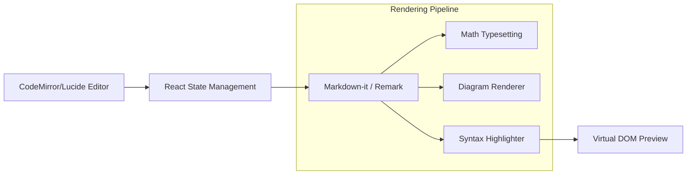

# ✍️ ZenMarkdown Editor (Next-Gen)

[](https://nextjs.org/)
[](https://react.dev/)
[](https://tailwindcss.com/)

A premium, high-performance Markdown editor designed for developers and technical writers. Built with **Next.js 14** and **React 18**, ZenMarkdown provides a distraction-free environment with real-time rendering, math typesetting, and diagram support.

## 🚀 Professional Features

- **Real-time Dual Preview**: Low-latency synchronization between the editor and the rendered output.
- **Scientific Ready**: Full support for **KaTeX** math equations and **Mermaid.js** diagrams.
- **Rich Syntax Highlighting**: Powered by Prism.js/Shiki for 100+ languages.
- **Export Engine**: One-click export to high-quality PDF, HTML, or Raw Markdown.
- **Persistence**: Auto-save to LocalStorage ensures your work is never lost during crashes.

## 🏗️ Technical Architecture



## 🛠️ Tech Stack
- **Framework**: Next.js 14 (App Router)
- **Language**: TypeScript
- **State**: React Context API + Hooks
- **Styling**: Tailwind CSS (Glassmorphism design)
- **Icons**: Lucide-React

## 🚦 Getting Started

### Local Development
```bash
# Install dependencies
npm install

# Start the dev server
npm run dev
```

### Production Build
```bash
npm run build
npm start
```

---
**Developed by Zeca** | *Engineering Modern Web Tools*
**ZenMarkdown © 2026**
